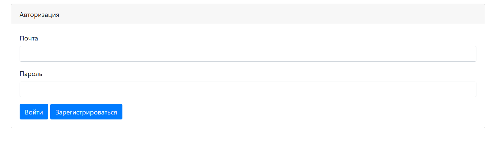
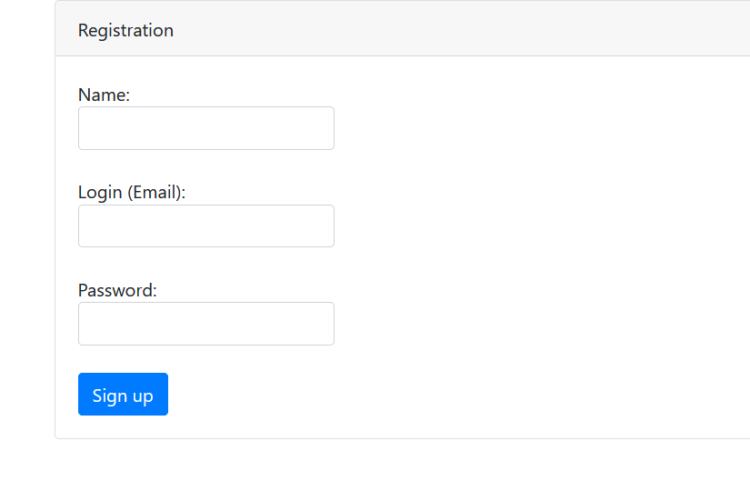
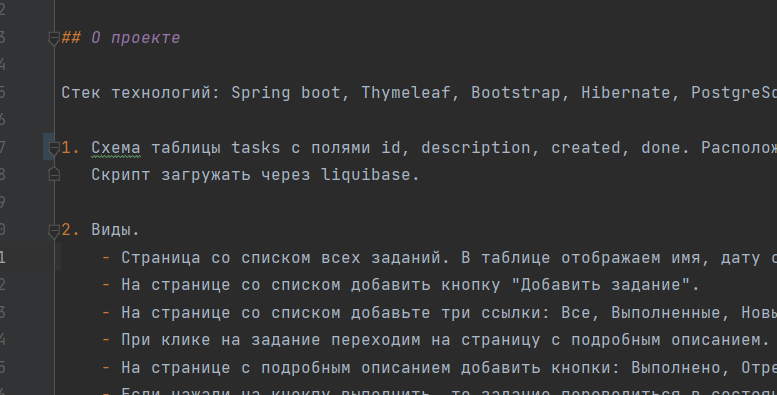
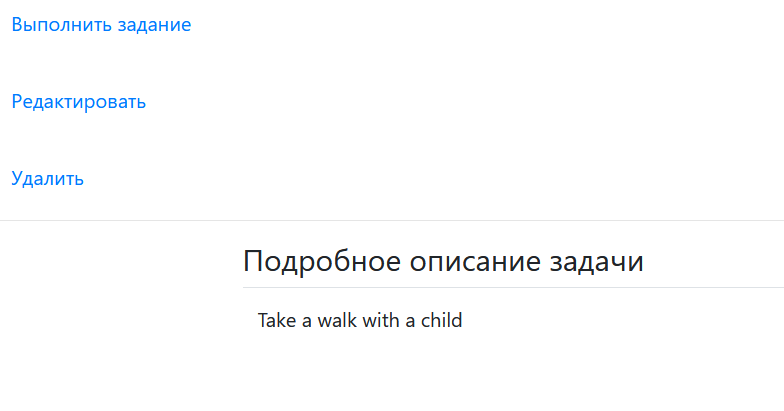

# Веб-приложение "TODO List"

Приложение представляет собой сервис для составления списка задач.
### Стек технологий:

*     Spring boot
*     Thymeleaf
*     Bootstrap
*     Hibernate
*     PostgreSql
Функциональные возможности приложения:
Страница входа:
*     Вход
*     Переход к регистрации

Страница регистрации:
* Имя пользователя
* Логин (email) должен быть уникальным
* Пароль

В таблице отображается название, дата создания и состояние (выполнено или нет)

На странице со списком
* Кнопка "Добавить задание"
Ссылки:
* Все
* Выполненные
* Новые

На странице с подробным описанием кнопки: 
* Выполнено - перевод в статус "Выполнено"
* Отредактировать
* Удалить

