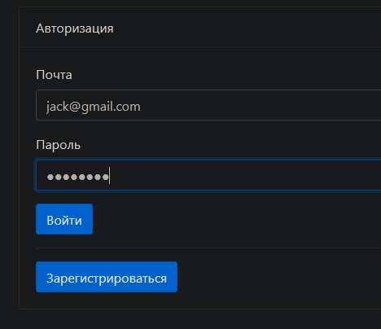

# WEB Application - "TODO list"

<p>This project represents Web Application on Spring Book Framework</p>

### Functionality:

* Works in the form of notes, plans and tasks to complete.
* The application works through Internet browser.
* The system has two models: Tasks, Task Categories, Users.
* User creates a job to run. When entering the service, the User enters the authorization page.
  Moreover, if the user is not authorized, then transitions to pages are possible.
  From the "login" page it is possible to register a new user.
* User can select a list of categories for the task
* Displays all tasks of authorized user.
* "Выполненные задания" link displays completed jobs for an authorized user.
* When you click on the task, you go to the detailed description of the task, where it is also possible to go to the
  page editing.
* User Authorization and Authentication implemented by Servlet Filter

### Assembly and installation:

1. Create "todolist_db" database or your own database
2. Change your PostgreSQL database username, password or url database in 'src/main/resources/hibernate.cfg.xml'
3.   Using Spring Boot CLI
```shell
mvn spring-boot:run -Dspring-boot.run.arguments=--db=your_database,--user=your_user,--password=your_password,--port=your_port
```
OR using default properties(db=todolist_db, user=postgres, password=password, port=5432)

```shell
mvn spring-boot:run
```
3. Go to http://localhost:8080

### TODO list
The program can:
1. Create, read, update tasks
2. Has an interface for managing and modifying tasks
3. Register on the website
4. Sing in website

### Used technologies:


### Screenshots




### Contact:
If you have any questions, feel free to contact me https://t.me/VadimDedeyko

<!-- 
brightgreen
green
yellowgreen
yellow
orange
red
blue
lightgrey
success
important
critical
informational
inactive
blueviolet
ff69b4
9cf 
-->

